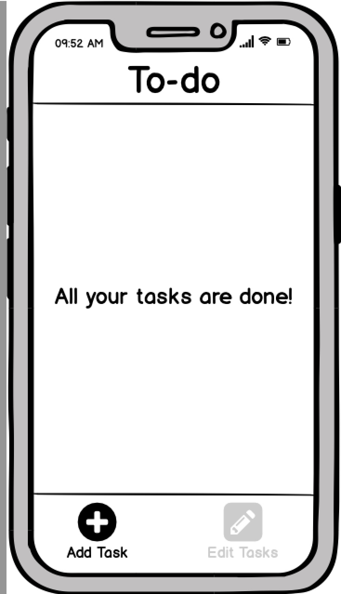
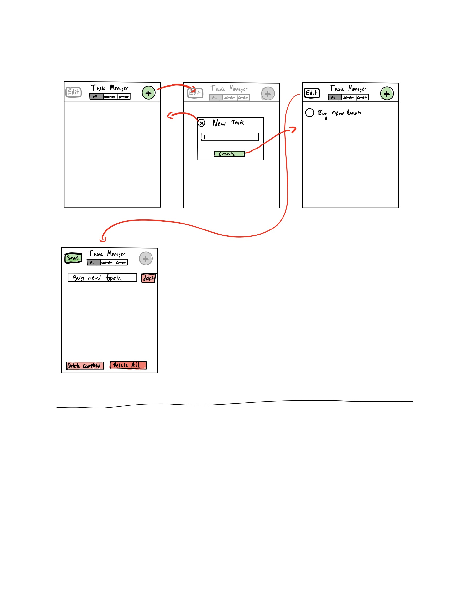

## Design Overview

We began our project with sketches of our to-do list application on paper. This draft included only two buttons: one to add an item, and one to remove an item. We also toyed with the idea of adding an edit button. We wanted to start simple, run some user testing, and see how the layout should change.

We then made mockups on Balsamiq to use for our user tests.

However, after doing a user test with both of our roommates, we found that the process of getting to only uncompleted tasks was tricky. We also noticed that toggling between all tasks and uncompleted tasks could not be done in less than 2 clicks, which was a functionality we wanted to include.

As a result, we made a second version of our paper draft. Here, we made edit and add buttons across the top, with a toggling bar at the bottom where users can jump from uncompleted tasks to all tasks.

We then used the notes app to make some UI mockups of our HTML files. Looking specifically at the edit task, we had a first version where users could edit one task at a time. We thought this format could be useful for users who needed to edit tasks, without running the risk of accidentally deleting multiple tasks:

We ended up deciding against this design, since we found this layout to be cumbersome for users who wanted to edit multiple tasks. While it did allow for more security for users not accidentally deleting tasks, we found (through more user testing) that the inability to edit multiple tasks at once without more key-presses was a bigger concern than that of accidental task deletes. 

The new design also allowed the UI to be more simple, since one edit button would cover the function of editing all tasks. Here is the wireframe for the design we ultimately went with:

Another change we made was the ordering of the toggle bar at the bottom. Initially, the homepage had the "Show All Tasks" and the "Show Uncompleted Tasks", respectively. However, in the edit bar, we have first "Delete All Uncompleted Tasks", and then "Delete All Tasks". We wanted to make the relative locations consistent across the homepage and edit screens, so the final HTML pages have "Show Uncompleted Tasks" and "All Tasks" in this order. 

### Challenges we faced:
One of the most difficult parts of this project for us was finding the best UI for the to-do list. There were many options that seemed to function just fine, but weighing the pros and cons of different UI's was one challenging component. 

### What we're most proud of:
