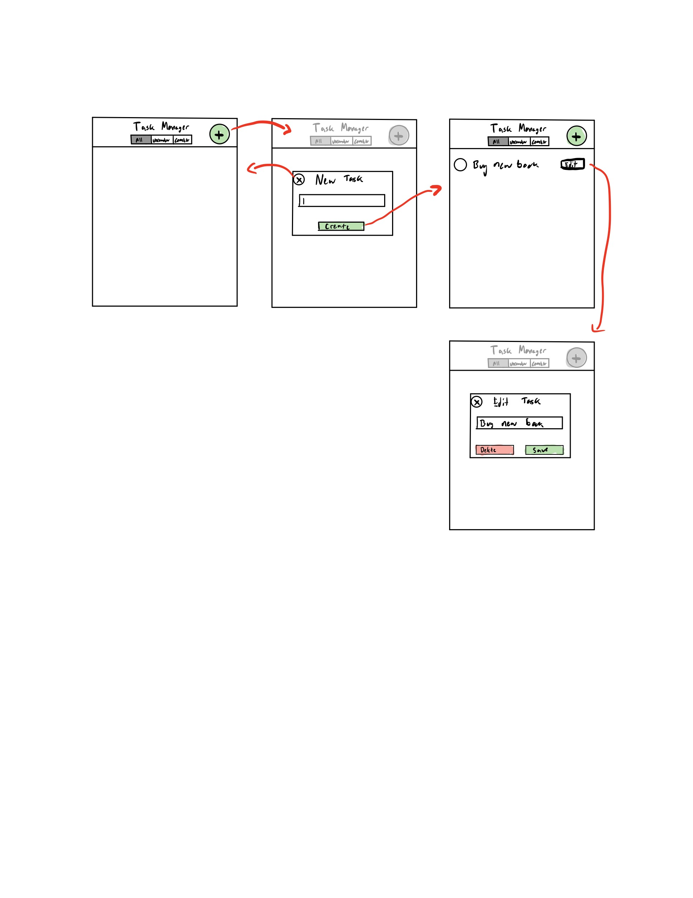

## Design Overview

We began our project with sketches of our to-do list application on paper. This draft included only two buttons: one to add an item, and one to remove an item. We also toyed with the idea of adding an edit button. We wanted to start as simple as possible, run some user testing, and update our to-do list layout accordingly.

After making the initial paper draft, we then made mockups on Balsamiq to use for our user tests. We handed the Balsamiq slides to our test users (roommates), told them what the required tasks our UI should support, and observed how they navigated the different screens.

After doing a user test with both of our roommates, we found that the process of getting to only uncompleted tasks did not exist. We decided to tweak our design so that getting to uncompleted tasks could take less than 2 clicks, following the 80-20 rule. We also wanted to implement a way for users to switch between all tasks and uncompleted tasks to monitor daily progress and see what tasks have been accomplished throughout the day.

As a result, we made a second version of our paper draft. Here, we made edit and add buttons across the top, with a toggling bar at the bottom where users can jump from uncompleted tasks to all tasks.

We then used the notes app to make some UI mockups of our HTML files. Looking specifically at the edit task, we had a first version where users could edit one task at a time. We thought this format could be useful for users who needed to edit tasks, without running the risk of accidentally deleting multiple tasks:

We ended up deciding against this design, since we found this layout to be cumbersome for users who wanted to edit multiple tasks. While it did allow for more security (users could not accidentally delete multiple tasks) we found out via more roommate user testing that the inability to edit multiple tasks at once without more key-presses was a bigger concern than that of accidental task deletes. 

The new design also allowed the UI to be more simple, since one edit button would cover the function of editing all tasks. Here is the wireframe for the design we ultimately went with, except that we moved the tab switcher to the bottom since it was hard to click at the top:

### Challenges we faced:
One of the most difficult parts of this project for us was finding the best UI for the to-do list. There were many options that seemed to function just fine, but weighing the pros and cons of different UI's was one challenging component. 

### What we're most proud of:
One of the things we're most proud of is the ability for users to add tasks, delete tasks, view all uncompleted tasks, and view all tasks (uncompleted or not) all within 3 keypresses. 

We also were proud of how critical we were with design iteration. We went through many versions of our to-do list. 

####In an empty list, create an item named "Buy new John Grisham book"
Screen at the beginning of task:

Screen during task:

Screen after task:

####In a non-empty list, create an item named "Eat Lunch"
Screen at the beginning of task:

Screen during task:

Screen after task:

####Mark the item named "Call Mom" completed (assumes there exists an item named "Call Mom").
Screen at the beginning of task:

Screen during task: N/A

Screen after task:

####Rename the item "Text John" to "Text John about bank statements" (assumes there exists an item named "Text John").
Screen at the beginning of task:

Screen before renaming:

Screen after renaming:

Screen after task:

####Show only uncompleted items.
Screen at the beginning of task:

Screen during task: N/A

Screen after task:

####Delete all completed items.
Screen at the beginning of task:

Screen during task:

Screen during task:

Screen after task:
