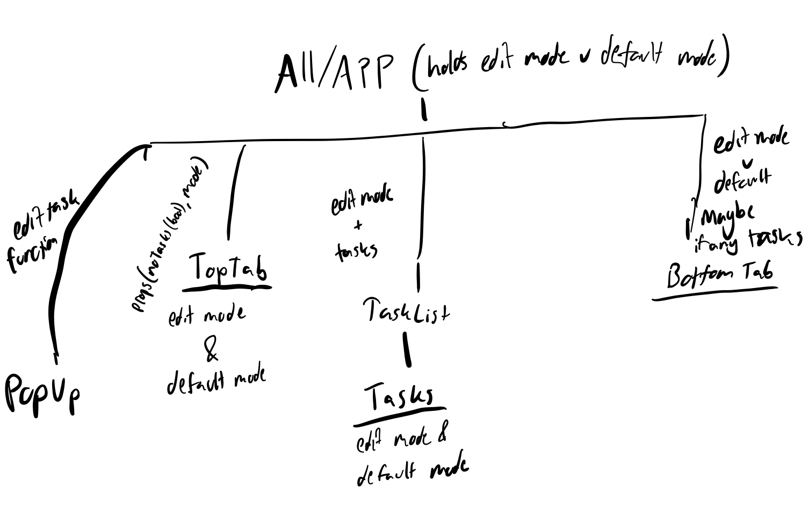

## Design Overview

To begin lab 2, we started by deciding on our component hierarchy. That is, what parts of the UI should be displayed by what components. We ended up going with an App parent component, with children:  PopUp, TopTab, TaskList, and Bottom Tab. From there, TopTab will have two modes (edit and default), and TaskList with have children Tasks (who also will have an edit and default mode).

Our overall component hierarchy is displayed below:

The idea was, since our design breaks up the screen into a top tab, center area containing the list of tasks, and a bottom tab, these components would be a good way to break up the UI. In addition, certain modes correspond to visual indicators (e.g, graying out the "add task" button when actively editing another task), so we decided that this component scheme would be the simplest to implement.

An alternate design for the component hierarchy that we considered but did not decide on was having edit/default mode be the parents for toptab and tasklist, but couldn't think of a way to do this without code duplication. Following "DRY" guidelines, we scrapped this idea. 
