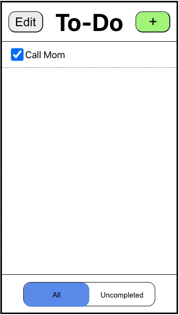

## Design Overview

To begin lab 2, we started by deciding on our component hierarchy.

Our first iteration (pictured below) included having edit/default mode be the parents for toptab and tasklist, but we realized it didn't make sense to have empty components just to hold state, so we scrapped this idea.

We then redesigned with an App parent component with a state to hold edit mode vs default mode, with children:  AddPopUp, TopTab, TaskList, and Bottom Tab. From there, TopTab would take in whether there are any tasks and the app mode, and TaskList with have children Tasks (who also will take in edit vs default mode). Additionally, the BottomTab would take in edit mode vs default mode.

The component hierarchy we created is displayed below:

The idea was, since our design breaks up the screen into a top tab, center area containing the list of tasks, and a bottom tab, these components would be a good way to break up the UI. In addition, certain modes correspond to visual indicators (e.g, graying out the "add task" button when actively editing another task), so we decided that this component scheme would be the best to use.

During implementation, we realized we were missing a few details and had overlooked some important information. Below is a revised design hierarchy:

Our final application utilizes the hierarchy above. The index component just bolds the initial data and passes that as a prop to the InMemoryApp component. The InMemoryApp component has the state data, initialized from initialData. It passes this data into the main App. The main app then maintains an appMode state (default, addMode, editMode) and a tasksShowing state (all, uncompleted) and has functions to create, modify, and delete tasks. It passes combinations of these functions, states, and the overall app data to each of the child components, as detailed in the diagram.

### User Testing + Design Iteration:
Once again, we shamelessly utilized our roommates for user testing. First, after implementing our static implementation, we showed consecutive screens to the sample users. Then, after implementing the entire applicaiton, we did a final user test. Here was the feedback we received from our users (roommates):

* Delete buttons are useless/should be disabled when user has no tasks.
* Glitch occurred when users wrote a task but then didn't hit save, the next time they opened the add task button their previous text remained.
* Many components are shifted out of place.

And here was feedback that we observed:

* Users were able to add empty tasks (Ie, a task with no text).
* One user got stuck in edit mode with no tasks, not realizing that to exit one must hit "done". Below are the two screens, admittedly quite similar. 

No Task Regular            |  No Tasks Edit Mode
:-------------------------:|:-------------------------:
 |  

We ended up making a number of design changes, after both passes of user testing. First, we made it so that no empty tasks could be added by graying out the "add task" button when there's no text inputted yet. We also disabled the delete buttons when users had no tasks, and updated the CSS so that things were aligned and the correct size. 

We also changed the text for users who are in edit mode with no tasks, so now the two screens differ (pictured below). Our second pass of user testing confirmed that this was no longer confusing.

No Task Regular            |  No Tasks Edit Mode
:-------------------------:|:-------------------------:
 |  

Here is what the screen looks like for users who have yet to add text for the task to add:

The add task button is disabled and greyed out, so users are unable to add blank tasks anymore.

### Challenges We Faced:

We ran into a couple issues when dealing with ternary operators in components. We realized ternary operators needed to be within and HTML tag, and each of the possible outcomes must be one HTML tag (with children as necessary). This required us to add some divs and redesign our HTML for a few components.

We also found that React seemed to handle percentages slightly differently than pure HTML. We had to convert some CSS to absolute values. For example, we needed to make the popUp have opacity 1, because otherwise it was becoming grayed out by the background that previously had not covered it.

### What We're Proud Of:

We encountered a lot of design flaws that were tiny, but we chose to fix anyway. For instance, disabling the delete buttons when there were no tasks, or graying out the add task button when no text was input. Additionally, when confirming that they really want to delete all tasks, the button displays the amount of tasks and will say 'task' if there is one and 'tasks' if there are multiple. We really feel like we've developed a quite robust application that is very clear and simple to use.

I think our biggest achievement for this lab has to be our attention to detail.

### Final Design Flow

#### In an empty list, create an item named "Buy new John Grisham book"
Screen at the beginning of task (user opens up to-do app):

User clicking on plus icon leads to next screen.

Screen during task:

User typing in "Buy new John Grisham book" and tapping "Add Task" leads to next screen.

Screen after task:

User is able to view task that was added on home screen of to-do app.

#### In a non-empty list, create an item named "Eat Lunch"
Screen at the beginning of task (user opens up to-do app):

User clicking on plus icon leads to next screen.

Screen during task:

User typing in "Eat Lunch" and tapping "Add Task" leads to next screen.

Screen after task:

User is able to view task that was added on home screen of to-do app.

#### Mark the item named "Call Mom" completed (assumes there exists an item named "Call Mom").
Screen at the beginning of task (user opens up to-do app):

User clicking on either the checkbox or the words "Call Mom" leads to next screen.

Screen after task:

User is able to view that the "Call Mom" task was completed.

#### Rename the item "Text John" to "Text John about bank statements" (assumes there exists an item named "Text John").
Screen at the beginning of task (user opens up to-do app):

User clicks on the edit button to move to next screen.

Screen before renaming:

User sees "Text John" task has become a text box that is editable, and clicks on the box to begin editing on next screen.

Screen after renaming:

User has changed "Text John" to "Text John about bank statements", and clicks done to move to next screen.

Screen after task:

User's task has saved to "Text John about bank statements"

#### Show only uncompleted items.
Screen at the beginning of task (user opens up to-do app):

User clicks on "Uncompleted" widget at the bottom of the app to get to the next screen.

Screen after task:

User sees only uncompleted tasks.

#### Delete all completed items.
Screen at the beginning of task (user opens up to-do app):

User clicks edit to move to next screen.

Screen during task:

User presses on "delete all completed" button to move to next screen.

Screen during task:

User is then prompted to confirm their selection (to delete all tasks) to move to the next screen:

Screen during task:

Completed tasks have been deleted, user presses "done" button to move to the next screen:

Screen after task:

User's to-do list has been updated by deleting all completed tasks.

