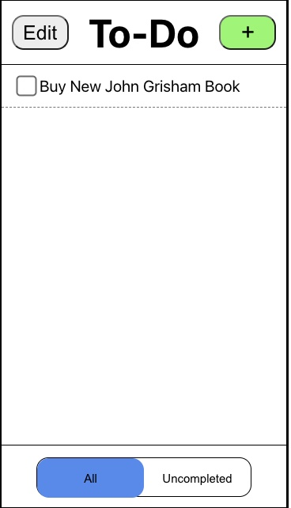
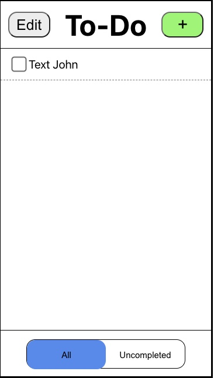
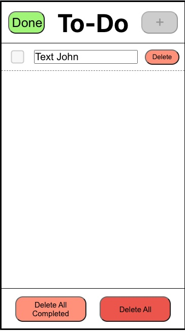
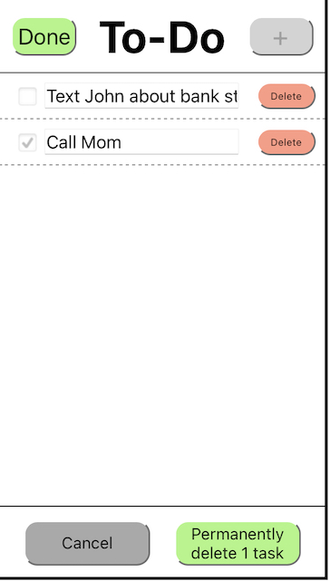
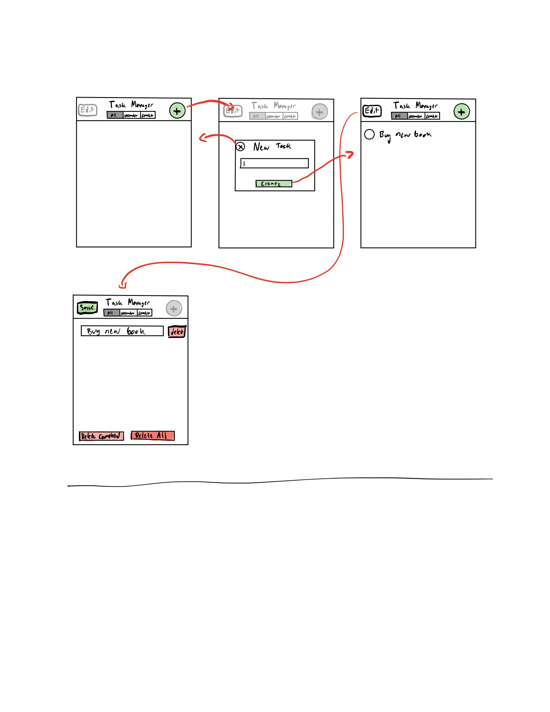

## Design Overview (Lab 4)

To begin lab 4, we ran the Developer tools "Lighthouse" accessibility checker on our lab 4. 

We found that many of our elements needed aria labels, as well as an error with aria attributes not matching. Our original score report is shown here. 

Our accessibility score originally:

We then went through and fixed any of the Lighthouse-noticed accessibility issues, namely many buttons named "button" rather than more descriptive names.

After fixing our accessibility score, we began manipulating the screen sizes. 

First, we went through and ensured that the title and bottom-bar elements remained centered as the screen grew. 
In addition, we made sure that the text boxes would grow length-wise but not height-wise when using larger screens, to accommodate the desired outcome of being able to display more tasks on a larger screen.

We also made sure that the app remained functional and user-friendly when used by users with low-vision. Here is a series of screenshots of our application, starting at 100% all the way up to 200%.

100% Screen Size:

125% Screen Size:

150% Screen Size:

175% Screen Size:

200% Screen Size:

After this, we went ahead and tested the voiceover accessibility of our application by having one of us turn around while the other navigates around the screen. We added aria labels and changed class names as needed until both of us were able to tell exactly where in the application we were, entirely from voiceover.

We also ensured that our application could be easily used via the keyboard. Finally, we screen recorded our application being used purely from the keyboard, as well as using the voiceover commands, and uploaded the video to Youtube.

This video can be accessed here:

https://www.youtube.com/watch?v=fnH-Ian-2Is

*Note, the video and resized screen screenshots were taken prior to our implementation of multiple lists. The updated flow with these changes can be seen below, in the "final flow" section of the design doc.*

After adding our accessibility and screen-resizing editions, we tackled implementing multiple lists of tasks. We began by sketching out some wireframes of how we thought our new UI should look. 

Below is our first-draft of the multiple lists UI, using tabs. 

List First Draft:

We began implementing this approach, but ran into an issue with this UI. The issue being, as the number of lists grows, one of two things must occur: 
1. The tabs get increasingly smaller and smaller (causing many list names to get cut off).

2. Users are forced to scroll in order to see all their lists.

We found that neither outcome was particularly user-friendly (again, validated by asking our trusty roommates), and decided to go with a slightly different UI.

Final Draft Lists:

*Another note, when we were adding the finishing touches to our final screen, we noticed that the list manager button was not aligned with the edit and add buttons.
We fixed this on the final screen, so our final UI looks like this:

We swapped tabbing for a drop-down selector, in which users can toggle between lists. 
We also added a list-manager function, which lets users delete, edit or add new lists.
It also lets them select which list is their "default" list.

The default list is created when users open their to-do list app, and before any other list is added. 
After making another list, users can toggle their default list to another list of their choosing.

### User Testing + Design Iteration:

After showing our initial implementation of the screen re-design to one of our suitemates, we realized that we could also make the sorting filter grow in size, similarly to how the tasks grow in length (only horizontally).

Below are a couple screenshots of our newly designed screen-resizing application:

MotoG4

IphoneX

IPad Pro

Desktop

### Challenges We Faced:
One of the main challenges we faced was deciding how to work through our tab implementation. 

At first, it sounded like the simplest thing to do would be to use the react tab-components package, but as it turns out, creating new indices was not always the easiest.

As a result we ended up writing our own tabbing implementation, which leads us to...

### What We're Proud Of:

Our overall design for supporting multiple lists, as well as the attention to detail with accessibility.

Overall, we found this to be one of the tougher labs, but are proud of our ability to work through challenges and complete an application we are both very proud of.

### Final Design Flow:

### Final Design Flow

#### In an empty list, create an item named "Buy new John Grisham book"
Screen at the beginning of task (user opens up to-do app):

User clicking on plus icon leads to next screen.

Screen during task:

User typing in "Buy new John Grisham book" and tapping "Add Task" leads to next screen.

Screen after task:

User is able to view task that was added on home screen of to-do app.

#### In a non-empty list, create an item named "Eat Lunch"
Screen at the beginning of task (user opens up to-do app):

User clicking on plus icon leads to next screen.

Screen during task:

User typing in "Eat Lunch" and tapping "Add Task" leads to next screen.

Screen after task:

User is able to view task that was added on home screen of to-do app.

#### Mark the item named "Call Mom" completed (assumes there exists an item named "Call Mom").
Screen at the beginning of task (user opens up to-do app):

User clicking on either the checkbox or the words "Call Mom" leads to next screen.

Screen after task:

User is able to view that the "Call Mom" task was completed.

#### Rename the item "Text John" to "Text John about bank statements" (assumes there exists an item named "Text John").
Screen at the beginning of task (user opens up to-do app):

User clicks on the edit button to move to next screen.

Screen before renaming:

User sees "Text John" task has become a text box that is editable, and clicks on the box to begin editing on next screen.

Screen after renaming:

User has changed "Text John" to "Text John about bank statements", and clicks done to move to next screen.

Screen after task:

User's task has saved to "Text John about bank statements"

#### Show only uncompleted items.
Screen at the beginning of task (user opens up to-do app):

User clicks on "Uncompleted" widget at the bottom of the app to get to the next screen.

Screen after task:

User sees only uncompleted tasks.

#### Delete all completed items.
Screen at the beginning of task (user opens up to-do app):

User clicks edit to move to next screen.

Screen during task:

User presses on "delete all completed" button to move to next screen.

Screen during task:

User is then prompted to confirm their selection (to delete all tasks) to move to the next screen:

Screen during task:

Completed tasks have been deleted, user presses "done" button to move to the next screen:

Screen after task:

User's to-do list has been updated by deleting all completed tasks.

## Design Overview (Lab 3)

To begin lab 3, we began by drafting some wireframes for our new UI with sorting functionality added. We wanted to maintain the simple design our previous iterations had, but also make the new functionality of sorting clear to use. We decided to do this by adding a sort button to the homepage next to the edit icon, as well as a priority level prompt when a user goes to add a task. Our wireframes for these two additions are below:

UI for Sorting

UI for Adding

We then decided to make our own Firebase project and Firestore application. We called it CS124Lab3, and began by verifying that after adding the import statements and parsing our code to use cloud storage, we saw the changes on the server on Firestore. 

### User Testing + Design Iteration:
For our design iteration, one of the first things we did after implementing our new sort button was try it out on a couple friends. One suggested changing the "edit" button to an icon, since both the sort and add buttons had icons but the edit button was text. 

Another thing we noticed is that the priority indicators (for us, the exclamation points) didn't stand out enough, which resulted in some confusion during user testing. In the following iteration we changed the font of the exclamation points to red, which helped them stand out from the actual task name. 

Now, our homepage changed to the following layout: 

Another thing we noticed in user testing is that users still had trouble connecting the priority levels (low, medium, high) to the exclamation points they see on the home screen next. To make this clearer, we added exclamation points to the button themselves, so that users made the connection easier. 

After re-showing the changes to our friends/user test subjects, we verified that this helped clear up the confusion. 

Below is this small change:

Pre-Addition of Exclamations            |  Post-addition of Exclamations
:-------------------------:|:-------------------------:
 |  

For changing the priority, we wanted to make the UI as easy as possible to use, so we decided on a drop-down that appears in edit mode (over where the priority would go in regular mode) which can be toggled only in edit mode. 

This way, users wouldn't accidentally be able to change their priority level in the default list mode, but could do so with ease as soon as they enter the edit mode. 

Below is a walk-through of how this looks, changing the priority of CS124 Lab 3 to the highest priority, and dropping the other two to second-level priority. 

Pre-changing priority           |  During Changing Priority |  During Changing Priority  | Done changing priority
:-------------------------:|:-------------------------:|:-------------------------:|:-------------------------:
 |   |   |  

Finally, after one final pass of user testing, we found that users couldn't currently view what their tasks were being sorted by, so we rearranged the top tab to make the sorting button a drop-down. We also hid the edit and add buttons in edit mode. In addition, we added a rewind / go-back button, which allowed users to leave edit mode and revert any changes they made. 

Here are those changes:

New Homepage UI:

Priority Level Dropdown:

New edit mode:

Loading / Error mode:

Note that for us to add this loading mode we did add a new mode to our App.js, as well as pass in a few values as props. 

Finally, one small comment is that we realized sorting zero or 1 tasks isn't logical, so we disabled the sorting dropdown when there are less than 2 tasks.

### Challenges We Faced:

We had a lot of trouble deciding how we wanted to implement the sort functionality without cluttering up the minimalist feel of our lab2 UI. We considered another switcher type button similar to what we used for the all/uncompleted tasks, but felt that including all three sorting options would look to cluttered. We also thought about shifting down the row of buttons (edit, sort, and add) below "To-do", but decided against this because we felt it took up too much screen real-estate. 

We also had a couple small issues with formatting when adding the new sort button, since adding in a new component influenced the other two buttons and our title in the TopTab.js file. 

### What We're Proud Of:

We are most proud of our iterative process, which involved numerous redesigns of our previous lab. For instance, we found that adding a drop-down for priority levels made it so that the edit button had no room, so we rearranged our top toolbar so that the edit and add buttons are on the top right, while the priority level dropdown now lives in the top left. 

We also went through user testing for our new additions, which was useful for a couple of reasons. One, one of our friends pointed out that it was pointless to have the edit and add buttons greyed out but not able to be used, so they suggested removing them entirely. This allowed us to keep the priority level drop-down in-place, while moving the save button to the top right, and adding the rewind button. 

In addition, we have a loading and error mode. In the loading mode, and loading gif appears to indicate the page loading. If the page is unable to be loaded, users receive an error pop-up.

We also went back and implemented all of the "would be nice's" from the lab 2 rubric, barring strikethrough for completed tasks. 

Overall, we tried our best to design the application to be as simple as possible while implementing many options for users.

### Final Design Flow
Very similar to lab 2, except we now rearranged the ordering of a few of the buttons (moving the priority level drop-down to the left, and the edit and add on the top-right, as well as the save button in edit mode). These changes have been documented above, but the overall functionality for adding / deleting tasks remains the same. We also made a small change to the delete button in edit mode to the right of each task, which now uses a unicode trash can.

Any changes that we made are documented under the "User Testing + Design Iteration."

## Design Overview (Lab 2)

To begin lab 2, we started by deciding on our component hierarchy.

Our first iteration (pictured below) included having edit/default mode be the parents for toptab and tasklist, but we realized it didn't make sense to have empty components just to hold state, so we scrapped this idea.

We then redesigned with an App parent component with a state to hold edit mode vs default mode, with children:  AddTaskPopUp, TopTab, TaskList, and Bottom Tab. From there, TopTab would take in whether there are any tasks and the app mode, and TaskList with have children Tasks (who also will take in edit vs default mode). Additionally, the BottomTab would take in edit mode vs default mode.

The component hierarchy we created is displayed below:

The idea was, since our design breaks up the screen into a top tab, center area containing the list of tasks, and a bottom tab, these components would be a good way to break up the UI. In addition, certain modes correspond to visual indicators (e.g, graying out the "add task" button when actively editing another task), so we decided that this component scheme would be the best to use.

During implementation, we realized we were missing a few details and had overlooked some important information. Below is a revised design hierarchy:

Our final application utilizes the hierarchy above. The index component just bolds the initial data and passes that as a prop to the InMemoryApp component. The InMemoryApp component has the state data, initialized from initialData. It passes this data into the main App. The main app then maintains an appMode state (default, addMode, editMode) and a tasksShowing state (all, uncompleted) and has functions to create, modify, and delete tasks. It passes combinations of these functions, states, and the overall app data to each of the child components, as detailed in the diagram.

### User Testing + Design Iteration:
Once again, we shamelessly utilized our roommates for user testing. First, after implementing our static implementation, we showed consecutive screens to the sample users. Then, after implementing the entire application, we did a final user test. Here was the feedback we received from our users (roommates):

* Delete buttons are useless/should be disabled when user has no tasks.
* Glitch occurred when users wrote a task but then didn't hit save, the next time they opened the add task button their previous text remained.
* Many components are shifted out of place.

And here was feedback that we observed:

* Users were able to add empty tasks (Ie, a task with no text).
* One user got stuck in edit mode with no tasks, not realizing that to exit one must hit "done". Below are the two screens, admittedly quite similar. 

No Task Regular            |  No Tasks Edit Mode
:-------------------------:|:-------------------------:
 |  

We ended up making a number of design changes, after both passes of user testing. First, we made it so that no empty tasks could be added by graying out the "add task" button when there's no text inputted yet. We also disabled the delete buttons when users had no tasks, and updated the CSS so that things were aligned and the correct size. 

We also changed the text for users who are in edit mode with no tasks, so now the two screens differ (pictured below). Our second pass of user testing confirmed that this was no longer confusing.

No Task Regular            |  No Tasks Edit Mode
:-------------------------:|:-------------------------:
 |  

Here is what the screen looks like for users who have yet to add text for the task to add:

The add task button is disabled and greyed out, so users are unable to add blank tasks anymore.

One final note: After a suggestion from Prof. Rhodes, we moved the add, change, and delete functions from App.js (where they were previously stored) to the inMemoryApp.js component. 

### Challenges We Faced:

We ran into a couple issues when dealing with ternary operators in components. We realized ternary operators needed to be within and HTML tag, and each of the possible outcomes must be one HTML tag (with children as necessary). This required us to add some divs and redesign our HTML for a few components.

We also found that React seemed to handle percentages slightly differently than pure HTML. We had to convert some CSS to absolute values. For example, we needed to make the popUp have opacity 1, because otherwise it was becoming grayed out by the background that previously had not covered it.

Prof. Rhodes showed us how to encapsulate multiple tags using <> ... </>, which we were able to implement on our second pass of changes. We ended up adding this in a few places, simplifying our CSS for the top and bottom tabs.

### What We're Proud Of:

We encountered a lot of design flaws that were tiny, but we chose to fix anyway. For instance, disabling the delete buttons when there were no tasks, or graying out the add task button when no text was input. Additionally, when confirming that they really want to delete all tasks, the button displays the amount of tasks and will say 'task' if there is one and 'tasks' if there are multiple. We really feel like we've developed a quite robust application that is very clear and simple to use.

I think our biggest achievement for this lab has to be our attention to detail.

### Final Design Flow

#### In an empty list, create an item named "Buy new John Grisham book"
Screen at the beginning of task (user opens up to-do app):

User clicking on plus icon leads to next screen.

Screen during task:

User typing in "Buy new John Grisham book" and tapping "Add Task" leads to next screen.

Screen after task:

User is able to view task that was added on home screen of to-do app.

#### In a non-empty list, create an item named "Eat Lunch"
Screen at the beginning of task (user opens up to-do app):

User clicking on plus icon leads to next screen.

Screen during task:

User typing in "Eat Lunch" and tapping "Add Task" leads to next screen.

Screen after task:

User is able to view task that was added on home screen of to-do app.

#### Mark the item named "Call Mom" completed (assumes there exists an item named "Call Mom").
Screen at the beginning of task (user opens up to-do app):

User clicking on either the checkbox or the words "Call Mom" leads to next screen.

Screen after task:

User is able to view that the "Call Mom" task was completed.

#### Rename the item "Text John" to "Text John about bank statements" (assumes there exists an item named "Text John").
Screen at the beginning of task (user opens up to-do app):

User clicks on the edit button to move to next screen.

Screen before renaming:

User sees "Text John" task has become a text box that is editable, and clicks on the box to begin editing on next screen.

Screen after renaming:

User has changed "Text John" to "Text John about bank statements", and clicks done to move to next screen.

Screen after task:

User's task has saved to "Text John about bank statements"

#### Show only uncompleted items.
Screen at the beginning of task (user opens up to-do app):

User clicks on "Uncompleted" widget at the bottom of the app to get to the next screen.

Screen after task:

User sees only uncompleted tasks.

#### Delete all completed items.
Screen at the beginning of task (user opens up to-do app):

User clicks edit to move to next screen.

Screen during task:

User presses on "delete all completed" button to move to next screen.

Screen during task:

User is then prompted to confirm their selection (to delete all tasks) to move to the next screen:

Screen during task:

Completed tasks have been deleted, user presses "done" button to move to the next screen:

Screen after task:

User's to-do list has been updated by deleting all completed tasks.

## Design Overview (Lab 1)

We began our project with sketches of our to-do list application on paper. This draft included only two buttons: one to add an item, and one to remove an item. We also toyed with the idea of adding an edit button. We wanted to start as simple as possible, run some user testing, and update our to-do list layout accordingly.

After making the initial paper draft, we then made mockups on Balsamiq to use for our user tests. We handed the Balsamiq slides to our test users (roommates), told them what the required tasks our UI should support, and observed how they navigated the different screens.

After doing a user test with both of our roommates, we found that the process of getting to only uncompleted tasks did not exist. We decided to tweak our design so that getting to uncompleted tasks could take less than 2 clicks, following the 80-20 rule. We also wanted to implement a way for users to switch between all tasks and uncompleted tasks to monitor daily progress and see what tasks have been accomplished throughout the day.

We then used the notes app to make some UI mockups of our HTML files. Looking specifically at the edit task, we had a first version where users could edit one task at a time. We thought this format could be useful for users who needed to edit tasks, without running the risk of accidentally deleting multiple tasks:

We ended up deciding against this design, since we found this layout to be cumbersome for users who wanted to edit multiple tasks at once. While it did allow for more security (users could not accidentally delete multiple tasks) we found out via more roommate user testing that the inability to edit multiple tasks at once without more key-presses was a bigger concern than that of accidental task deletes.

The new design also allowed the UI to be more simple, since one edit button would cover the function of editing all tasks. Here is the wireframe for the design we ultimately went with, except that we moved the tab switcher to the bottom since it was hard to click at the top:

Finally, after submitting our first pull request, we received some feedback from Professor Rhodes that the "save" button may not have been the most clear for users. By changing this button to say "done" we attempted to mitigate confusion about how to return to the home screen and exit the editing mode.

### Challenges we faced:
One of the most difficult parts of this project for us was finding the best UI for the to-do list. There were many options that seemed to function just fine, but weighing the pros and cons of different UI's was one challenging component.

We also found that small changes to the CSS could potentially affect many components of our to-do list if we weren't careful, so we made sure to be purposeful about the labeling of our id's and classes.

### What we're most proud of:
One of the things we're most proud of is the ability for users to add tasks, delete tasks, view all uncompleted tasks, and view all tasks (uncompleted or not) all within 3 key presses.

We also were proud of how critical we were with design iteration. We went through many versions of our to-do list.

#### In an empty list, create an item named "Buy new John Grisham book"
Screen at the beginning of task (user opens up to-do app):

User clicking on plus icon leads to next screen.

Screen during task:

User typing in "Buy new John Grisham book" and tapping "Add Task" leads to next screen.

Screen after task:

User is able to view task that was added on home screen of to-do app.

#### In a non-empty list, create an item named "Eat Lunch"
Screen at the beginning of task (user opens up to-do app):

User clicking on plus icon leads to next screen.

Screen during task:

User typing in "Each Lunch" and tapping "Add Task" leads to next screen.

Screen after task:

User is able to view task that was added on home screen of to-do app.

#### Mark the item named "Call Mom" completed (assumes there exists an item named "Call Mom").
Screen at the beginning of task (user opens up to-do app):

User clicking on either the checkbox or the words "Call Mom" leads to next screen.

Screen after task:

User is able to view that the "Call Mom" task was completed.

#### Rename the item "Text John" to "Text John about bank statements" (assumes there exists an item named "Text John").
Screen at the beginning of task (user opens up to-do app):

User clicks on the edit button to move to next screen.

Screen before renaming:

User sees "Text John" task has become a text box that is editable, and clicks on the box to begin editing on next screen.

Screen after renaming:

User has changed "Text John" to "Text John about bank statements", and clicks done to move to next screen.

Screen after task:

User's task has saved to "Text John about bank statements"

#### Show only uncompleted items.
Screen at the beginning of task (user opens up to-do app):

User clicks on "Uncompleted" widget at the bottom of the app to get to the next screen.

Screen after task:

User sees only uncompleted tasks.

#### Delete all completed items.
Screen at the beginning of task (user opens up to-do app):

User clicks edit to move to next screen.

Screen during task:

User presses on "delete all completed" button to move to next screen.

Screen during task:

Completed tasks have been deleted, user presses "done" button to move to the next screen.

Screen after task:

User's to-do list has been updated by deleting all completed tasks.

